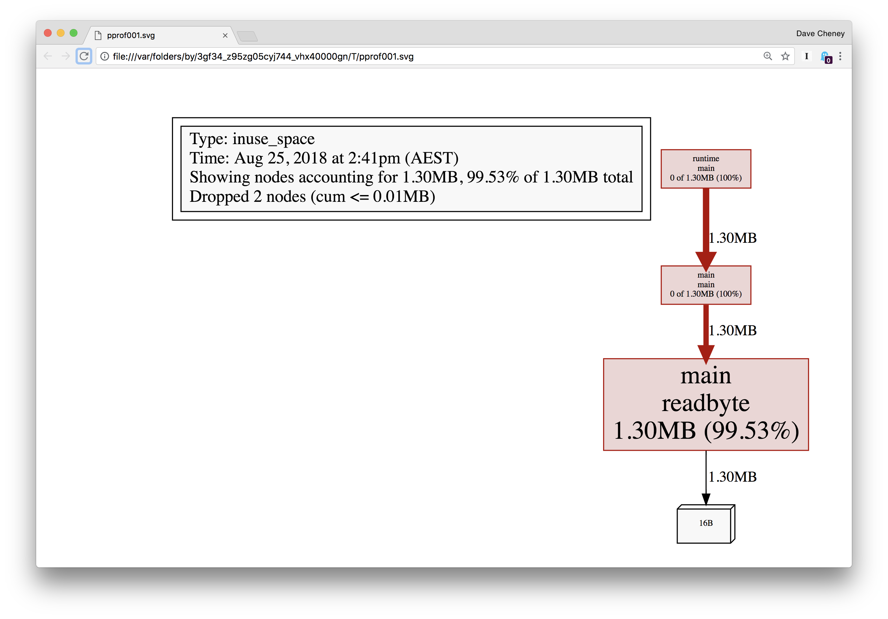
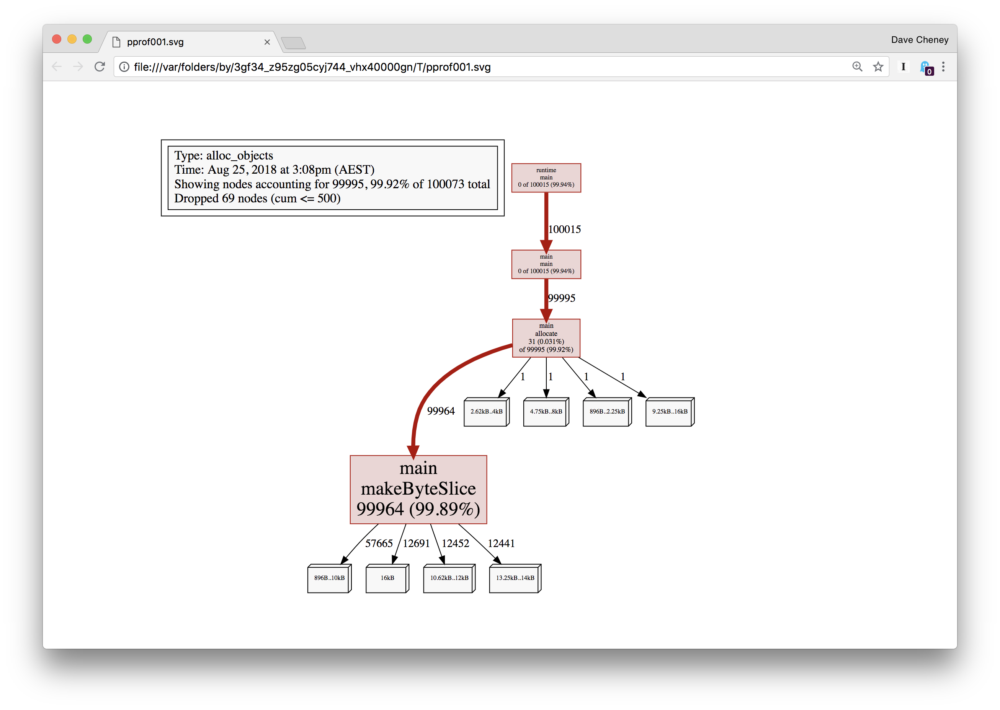
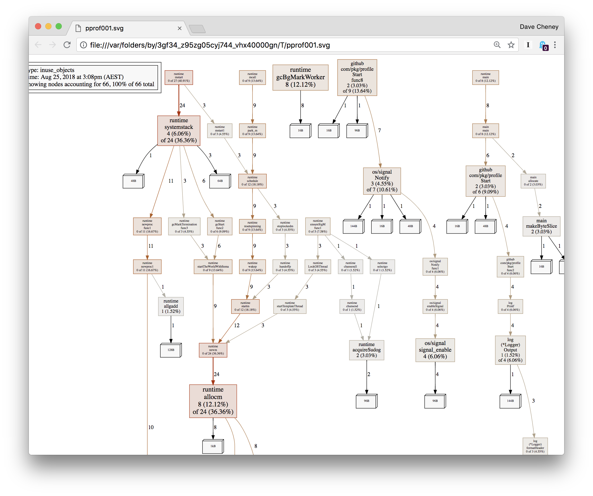
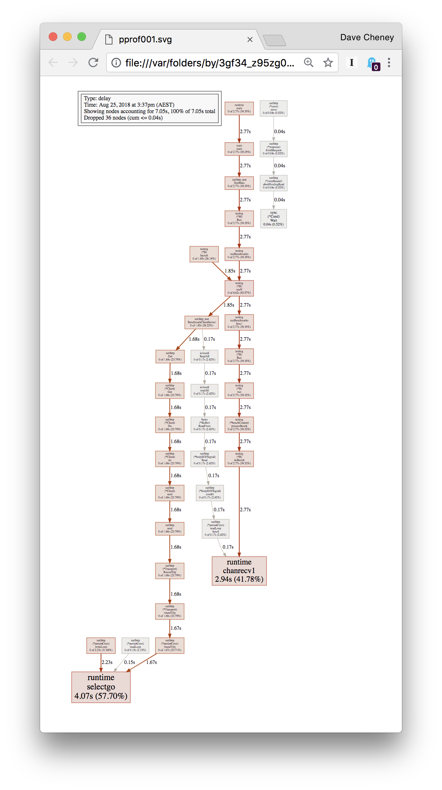

# 性能测量和分析

在先前的部分，我们研究了对单个函数的基准测试，当您提前知道瓶颈在哪里时，这是非常有用的。然而，你经常会发现自己处于提问的位置

> 为什么这个程序要运行这么长时间？

剖析整个程序，这对于回答诸如此类的高级问题非常有用。在本节中，我们将使用Go内置的分析工具从内部研究程序的操作。

## pprof

我们今天要讲的第一个工具是 _pprof_ 。 [pprof][1] 来自于 [Google Perf Tools][2] ，自最早的公开发布以来，已经集成到 Go 运行时中。

`pprof`  由两部分组成：

- `runtime/pprof` 每个 Go 程序都内置的包
- `go`tool`pprof` 用于解析 profile 文件

pprof 支持好几种类型的分析，我们今天将讨论其中的三种：

- CPU 分析
- 内存分析
- 阻塞分析
- 锁竞争分析

## CPU 分析

CPU 分析是最常见的类型，也是最明显的。

当启用 CPU 分析时，运行时将每 10ms 中断一次，并记录当前运行的 goroutines 的栈跟踪。

一旦分析文件完成，我们就可以解析它以确定运行时间最长的代码路径。

函数在分析文件中出现的次数越多，代码路径占总运行时间的百分比就越多。

## 内存分析

在进行堆分配时，内存分析会记录调用栈跟踪

栈分配被认为是无成本的，并且在内存 profile 中不被追踪

内存分析，就像 CPU 分析是基于样本的一样，默认情况下，每 1000 个分配中有 1 个内存分析样本。这个速率是可以改变的。

由于内存分析是基于样本的，并且因为它也跟踪尚没被使用的分配，因此使用内存分析来确定应用程序的总内存使用量是很困难的。

_个人想法:_ 我不认为内存分析对查找内存泄漏有用。有更好的方法来确定应用程序使用了多少内存。我们将在以后的文章中讨论这些。

## 阻塞分析

阻塞分析非常独特。

阻塞 profile 和 CPU profile 非常类似，但它记录了 goroutine 等待共享资源所花费的时间。

这对于确定应用程序中的并发瓶颈非常有用。

阻塞分析可以向你展示大量 goroutine 何时可以取得进展但是被阻塞了。包括:

- 在没有缓冲的 channel 上发送或接收
- 向已满的 channel 发送，或从一个空 channel 接收
- 试图 `Lock` 一个已经被另一个 goroutine 锁定的 `sync.Mutex`

阻塞分析是一个非常专业的工具，在你认为已经消除了所有 CPU 和内存使用瓶颈之前，不应该使用它。

## 互斥锁分析

互斥锁分析与阻塞分析类似，但只关注互斥锁竞争导致延迟的操作。

## 一次一个 profile

profile 记录是有成本的

profile 分析对程序性能有一种适度但可衡量的影响， 尤其是在增加内存分析采样率的情况下。

大多数工具不会阻止你同时启用多个 profile 。

**但还是不要一次启用多个 profile 。**

如果你同时启用多个 profile，他们将观察自己的互动并抛弃你的结果。

## 收集一个 profile

Go 运行时的分析接口存在于 `runtime/pprof` 包中。 `runtime/pprof` 是一个非常低级的工具，由于历史原因，不同类型 profile 的接口并不统一。

正如我们在前一节中所看到的，pprof 分析工具已经构建到 `testing` 包中，但有时，在`testing.B`基准测试的上下文中放置您想要分析的代码是不方便或困难的，并且必须直接使用`runtime/pprof` API。

这里有一个 [small package][0]，便于更容易地分析现有的程序。

```
import "github.com/pkg/profile"
    
func main() {
	defer profile.Start().Stop()
	...
}
```

我们将在本节中使用这个 profile 包。晚些时候，我们将直接使用`runtime/pprof`接口。

### 使用 pprof

解析使用 `go pprof` 子命令：

```
go tool pprof /path/to/your/profile
```

_注意_: 如果你已经使用 Go 一段时间了，你可能会被告知`pprof`有两个参数。从 Go 1.9 开始，profile 文件包含展示 profile 所需的所有信息。你不再需要生成 profile 的二进制文件了。  🎉

#### 进一步阅读

- [Profiling Go programs][4] (Go Blog)
- [Debugging performance issues in Go programs][5]

## CPU 分析 - 例1

我们写一个程序来计算单词数量：

```
package main

import (
        "fmt"
        "io"
        "log"
        "os"
        "unicode"
)

func readbyte(r io.Reader) (rune, error) {
        var buf [1]byte
        _, err := r.Read(buf[:])
        return rune(buf[0]), err
}

func main() {
        f, err := os.Open(os.Args[1])
        if err != nil {
                log.Fatalf("could not open file %q: %v", os.Args[1], err)
        }

        words := 0
        inword := false
        for {
                r, err := readbyte(f)
                if err == io.EOF {
                        break
                }
                if err != nil {
                        log.Fatalf("could not read file %q: %v", os.Args[1], err)
                }
                if unicode.IsSpace(r) && inword {
                        words++
                        inword = false
                }
                inword = unicode.IsLetter(r)
        }
        fmt.Printf("%q: %d words\n", os.Args[1], words)
}
```

让我们看看赫尔曼·梅尔维尔的经典[《白鲸记》][6] (源自古腾堡计划)中有多少单词。

```
% time go run main.go moby.txt
"moby.txt": 181275 words

real    0m2.110s
user    0m1.264s
sys     0m0.944s
```

来和 unix 系统的 `wc -w` 做一个比较

```
% time wc -w  moby.txt
  215829 moby.txt

real    0m0.012s
user    0m0.009s
sys     0m0.002s
```

结果不一样。wc 给出的字数高出 19% 左右，因为它计算一个词的规则与我的例子不同。这并不重要——两个程序都将整个文件作为输入，并在一次传递中计算从单词到非单词的转换次数。

让我们使用 pprof 调查这些程序为何具有不同的运行时间。

### 加入 CPU 分析

首先，编辑 `main.go` 并开启 profile

```go
        ...
        "github.com/pkg/profile"
)

func main() {
        defer profile.Start().Stop()
        ...
```

现在，当我们的程序运行起来时，会创建一个`cpu.pprof` 文件

```
% go run main.go moby.txt
2018/08/25 14:09:01 profile: cpu profiling enabled, /var/folders/by/3gf34_z95zg05cyj744_vhx40000gn/T/profile239941020/cpu.pprof
"moby.txt": 181275 words
2018/08/25 14:09:03 profile: cpu profiling disabled, /var/folders/by/3gf34_z95zg05cyj744_vhx40000gn/T/profile239941020/cpu.pprof
```

现在我们可用用 `go tool pprof`来分析它

```
% go tool pprof /var/folders/by/3gf34_z95zg05cyj744_vhx40000gn/T/profile239941020/cpu.pprof
Type: cpu
Time: Aug 25, 2018 at 2:09pm (AEST)
Duration: 2.05s, Total samples = 1.36s (66.29%)
Entering interactive mode (type "help" for commands, "o" for options)
(pprof) top
Showing nodes accounting for 1.42s, 100% of 1.42s total
      flat  flat%   sum%        cum   cum%
     1.41s 99.30% 99.30%      1.41s 99.30%  syscall.Syscall
     0.01s   0.7%   100%      1.42s   100%  main.readbyte
         0     0%   100%      1.41s 99.30%  internal/poll.(*FD).Read
         0     0%   100%      1.42s   100%  main.main
         0     0%   100%      1.41s 99.30%  os.(*File).Read
         0     0%   100%      1.41s 99.30%  os.(*File).read
         0     0%   100%      1.42s   100%  runtime.main
         0     0%   100%      1.41s 99.30%  syscall.Read
         0     0%   100%      1.41s 99.30%  syscall.read
```

 `top` 命令从降序展示了函数的调用时间。 我们可以看到在 `syscall.Syscall`上花费了 99% 的时间， 和 `main.readbyte`花费了很少的一部分。 

我们还可以使用web命令可视化这个调用。这将从 profile 数据生成有向图。它实际使用来自 Graphviz 的`dot`命令。


在图中，消耗 CPU 时间最多的盒子是最大的 -- 我们看到的`sys call.Syscall` 占用了总程序运行时间的 99.3%。通往`syscall.Syscall`的一串盒子代表它的直接调用者 -- 如果多个路径收敛于同一个函数，则表示有多个调用者。箭头旁边的数字表示运行所花费的时间。我们从 `main.readbyte` 开始看，一直到最后，占用都接近0。

### 改进我们的版本

我们程序跑慢不是因为 Go 的 `syscall.Syscall` 。因为系统调用本来就慢。

每次调用`readbyte`都会产生一个缓冲区大小为1的`syscall.Read`。因此，我们程序执行的系统调用数等于输入的大小。在 pprof 图中我们可以看到，读取输入决定了其他一切。

```go
func main() {
        f, err := os.Open(os.Args[1])
        if err != nil {
                log.Fatalf("could not open file %q: %v", os.Args[1], err)
        }

        b := bufio.NewReader(f)
        words := 0
        inword := false
        for {
                r, err := readbyte(b)
                if err == io.EOF {
                        break
                }
                if err != nil {
                        log.Fatalf("could not read file %q: %v", os.Args[1], err)
                }
                if unicode.IsSpace(r) && inword {
                        words++
                        inword = false
                }
                inword = unicode.IsLetter(r)
        }
        fmt.Printf("%q: %d words\n", os.Args[1], words)
}
```

这样我们可以通过在输入文件和`readbyte` 之间插入`bufio.Reader`来提升性能。

## 内存分析

`words` profile 还告诉了我们，`readbyte` 函数内部分配了一些东西。我们可以使用 pprof 进行研究。

```go
defer profile.Start(profile.MemProfile).Stop()
```

然后正常运行程序

```
% go run main2.go moby.txt
2018/08/25 14:41:15 profile: memory profiling enabled (rate 4096), /var/folders/by/3gf34_z95zg05cyj744_vhx40000gn/T/profile312088211/mem.pprof
"moby.txt": 181275 words
2018/08/25 14:41:15 profile: memory profiling disabled, /var/folders/by/3gf34_z95zg05cyj744_vhx40000gn/T/profile312088211/mem.pprof
```



正如我们所怀疑的那样，分配来自 `readbyte` -- 这并不复杂，只有三行代码：

```go
func readbyte(r io.Reader) (rune, error) {
        var buf [1]byte // allocation is here
        _, err := r.Read(buf[:])
        return rune(buf[0]), err
}
```

我们将在下一节详细讨论为什么会发生这种情况，但目前我们看到的是，每个对`readbyte`的调用都在分配一个新的1字节长的数组，而这个数组正在堆上分配。

### 分配对象 vs. 使用中的对象

内存分析有两种选择，以 `go tool pprof` 工具的标识命名：

- `-alloc_objects` 报告每次分配时的所在的地方
- `-inuse_objects` 报告被使用的地方，可以在 profile 文件的末尾找到

为了说明这一点，这里有一个设计好的程序，它将以一种受控的方式分配一些内存。

```go
// ensure y is live beyond the end of main.
var y []byte

func main() {
        defer profile.Start(profile.MemProfile, profile.MemProfileRate(1)).Stop()
        y = allocate(100000)
        runtime.GC()
}

// allocate allocates count byte slices and returns the first slice allocated.
func allocate(count int) []byte {
        var x [][]byte
        for i := 0; i < count; i++ {
                x = append(x, makeByteSlice())
        }
        return x[0]
}

// makeByteSlice returns a byte slice of a random length in the range [0, 16384).
func makeByteSlice() []byte {
        return make([]byte, rand.Intn(1<<14))
}
```

该程序使用 profile 包进行标注，我们将内存采集速率设置为1——也就是说，每个分配都记录堆栈跟踪。这大大降低了程序的速度，但你很快就会明白为什么。

```
% go run main.go
2018/08/25 15:22:05 profile: memory profiling enabled (rate 1), /var/folders/by/3gf34_z95zg05cyj744_vhx40000gn/T/profile730812803/mem.pprof
2018/08/25 15:22:05 profile: memory profiling disabled, /var/folders/by/3gf34_z95zg05cyj744_vhx40000gn/T/profile730812803/mem.pprof
```

让我们看一下分配对象的图，这是默认值，并显示了导致 profile 文件中每个对象分配的调用图。

```
% go tool pprof -web -alloc_objects /var/folders/by/3gf34_z95zg05cyj744_vhx40000gn/T/profile891268605/mem.pprof
```


不足为奇的是超过 99% 的分配都是在 `makeByteSlice`内部进行的。现在让我们 换用`-inuse_objects`查看 profile

```
% go tool pprof -web -inuse_objects /var/folders/by/3gf34_z95zg05cyj744_vhx40000gn/T/profile891268605/mem.pprof
```


我们看到的不是在 profile 期间分配的对象，而是在 profile 获取时仍在使用的对象——这忽略了垃圾收集器回收的对象的堆栈跟踪。

## 阻塞分析 - 例1

我们将展示最后一种分析 - 阻塞分析。我们使用 `net/http`包中`ClientServer`的基准测试。

```
% go test -run=XXX -bench=ClientServer$ -blockprofile=/tmp/block.p net/http
% go tool pprof -web /tmp/block.p
```



## 帧指针

Go 1.7 已经发布，并且与 amd64 的新编译器一起，编译器现在默认启用帧指针。

帧指针是一个始终指向当前栈帧顶部的寄存器。

它支持使用 `gdb(1)` 和 `perf(1)` 等工具解析 Go 调用栈

详情可以参考下面的扩展阅读

## 进一步阅读：

- 七种方式分析 Go 程序 (幻灯片)[https://talks.godoc.org/github.com/davecheney/presentations/seven.slide]
- 七种方式分析 Go 程序 (视频，30分钟)[https://www.youtube.com/watch?v=2h_NFBFrciI]
- 七种方式分析 Go 程序 (网络直播，60分钟)[ https://www.bigmarker.com/remote-meetup-go/Seven-ways-to-profile-a-Go-program]

[0]: https://github.com/pkg/profile
[1]: https://github.com/google/pprof
[2]: https://github.com/gperftools/gperftools
[4]: http://blog.golang.org/profiling-go-programs
[5]: https://software.intel.com/en-us/blogs/2014/05/10/debugging-performance-issues-in-go-programs
[6]: https://www.gutenberg.org/ebooks/2701