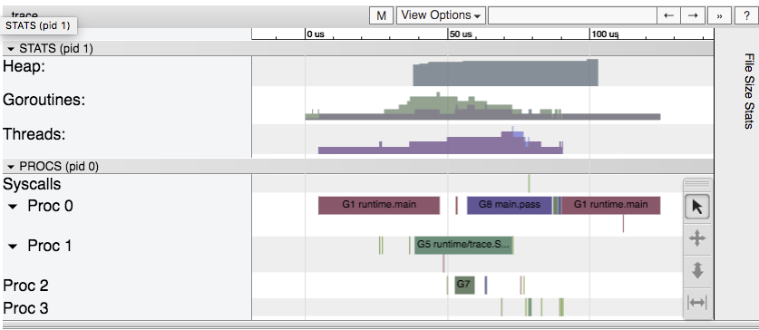
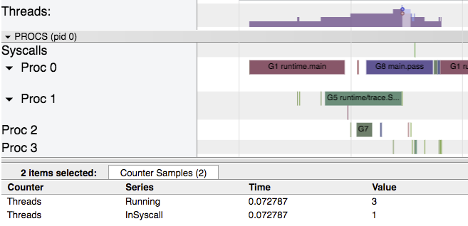
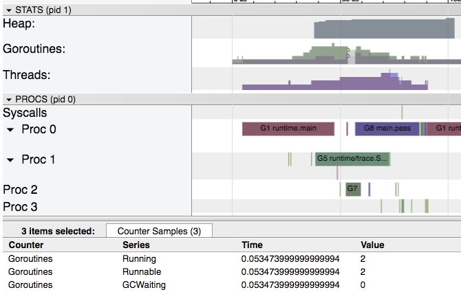
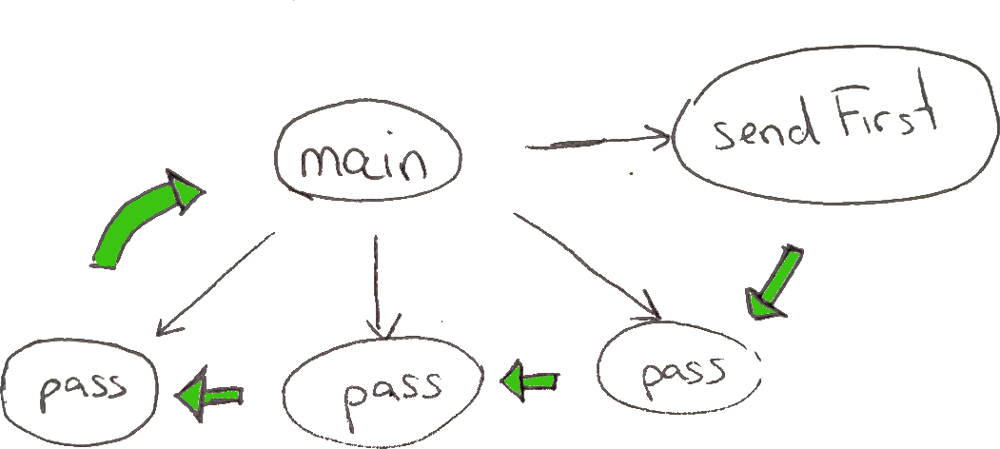

# Tracing Go programs

在 Go 1.5 中，添加了一个新的工具：执行跟踪器。在本章中，我们将了解跟踪器的作用以及它如何帮助我们在程序中指出性能问题。

与`pprof`不同的是，正如我们在检查 Go  程序当前执行的内容之前看到的，执行跟踪器使 Go 运行时在每次事件发生时主动报告。这些事件可以是 goroutine 的创建、系统调用、堆大小的更改等等。每次发生这些事件中的一个时，都会报告其时间戳和大多数事件的堆栈跟踪。

在启用Go执行跟踪器的情况下执行程序的结果是一个相当大的二进制文件，可以用 `go tool trace`进行分析。

## 第一个例子

关于Go执行跟踪器的一个很棒的事情是它不需要运行很长时间，因此我们可以通过简单地加上对`trace.Start`和`trace.Stop`的调用来了解程序的功能。

```go
package main

import (
	"log"
	"os"
	"runtime/trace"
)

func main() {
	_ = trace.Start(os.Stdout)
	defer trace.Stop()

	const n = 3

	leftmost := make(chan int)
	right := leftmost
	left := leftmost

	for i := 0; i < n; i++ {
		right = make(chan int)
		go pass(left, right)
		left = right
	}

	go sendFirst(right)
	log.Println(<-leftmost)
}

func pass(left, right chan int) {
	v := 1 + <-right
	left <- v
}

func sendFirst(ch chan int) { ch <- 0 }
```

因此，在不读取代码中任何其他内容的情况下，让我们只运行代码并存储跟踪输出。

```bash
$ go run daisy/main.go > trace.out
3
$ go tool trace trace.out
2017/07/10 17:47:47 Parsing trace...
2017/07/10 17:47:47 Serializing trace...
2017/07/10 17:47:47 Splitting trace...
2017/07/10 17:47:47 Opening browser
```

这将打开一个带有一系列链接的浏览器，让我们点击 `Goroutine analysis`，你会看到这样的东西：

```
Goroutines: 
runtime.main N=1 
main.pass N=3 
runtime/trace.Start.func1 N=1 
main.sendFirst N=1 
N=3 
```

好的，所以我们总共有5个 goroutines，一个正在运行`main`，一个正在运行`pass`，一个正在运行`sendFirst`。 还有一个运行跟踪器。

当我们点击 `Synchronization blocking profile` 你会看到一个有趣的图表。


看起来`main`和`pass`都花了相当多的时间尝试从一个 channel 接收。

现在让我们点击 `View trace`， 你会看到这样的东西：



好的，我们已经可以在这里看到很多信息了！让我们从线程的数量开始。在图形的`Threads`上单击任意位置，你将看到当时运行了多少个线程。



在本例中，我们看到有四个线程，其中一个用于系统调用。

类似地，你可以单击`Goroutines`行，并了解在程序的每个点上有多少个Goroutines。



看起来我们有4个，其中2个正在运行，并且没有一个被垃圾收集器阻塞。

Wow！ 甚至在我们 一行代码都没读之前，我们就可以从程序中理解很多东西！ 但现在是时候阅读代码了，以便更好地解释发生了什么。

```go
package main

import (
	"log"
	"os"
	"runtime/trace"
)

func main() {
	_ = trace.Start(os.Stdout)
	defer trace.Stop()

	const n = 3

	leftmost := make(chan int)
	right := leftmost
	left := leftmost

	for i := 0; i < n; i++ {
		right = make(chan int)
		go pass(left, right)
		left = right
	}

	go sendFirst(right)
	log.Println(<-leftmost)
}

func pass(left, right chan int) {
	v := 1 + <-right
	left <- v
}

func sendFirst(ch chan int) { ch <- 0 }
```

上述代码创建了一个通过 channel 连接的 goroutines 链，然后在一端发送值并等待在另一端接收该值。



现在我们知道了这一点，让我们回到跟踪查看器并分析依赖关系。

点击 `View Options`展开，选中`Flow Events`开启可视化。


花些时间浏览依赖关系图并尝试查看每个 goroutine 如何通过 channel 与其他 goroutine 同步。

